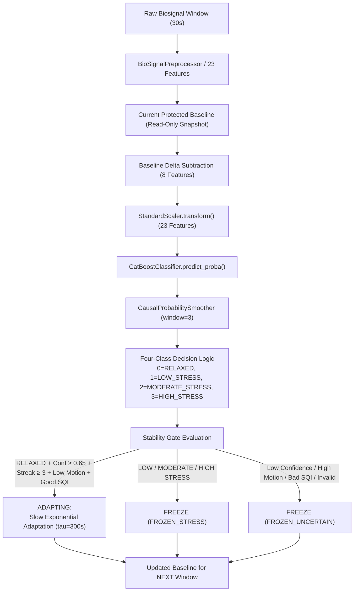
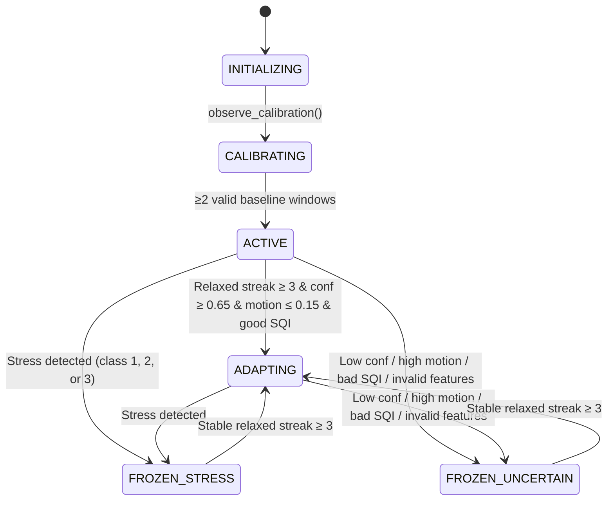

# PHASE 4 IMPLEMENTATION REPORT

> **Topic:** Protected Dynamic Personal Baseline  
> **Date:** 2026-10-05  
> **Status:** COMPLETE — IMPLEMENTED AND VALIDATED

---

## 1. Executive Summary

Phase 4 successfully implements and validates a **Protected Dynamic Personal Baseline** for the four-class physiological stress monitoring system.

The core objective is strictly achieved:
> **STRESS MUST NOT BECOME THE NEW BASELINE.**
> The baseline slowly adapts to natural resting physiological drift, but **FREEZES** during any stress, uncertainty, movement, or poor signal quality. Adaptation only resumes after a verified streak of stable relaxed states.

---

## 2. Dynamic Baseline Architecture

The system enforces a strict processing order to guarantee that incoming stress physiology never contaminates the baseline:



### Critical Processing Order Guarantee
1. Current window features are extracted.
2. The **current baseline snapshot** is subtracted from the 8 normalized features without mutation.
3. CatBoost executes 4-class inference and produces class probabilities and confidence.
4. **AFTER prediction is finalized**, the stability gate evaluates whether adaptation is safe.
5. If safe, the baseline updates for the *next* window. If not safe, the baseline is frozen.

---

## 3. Explicit State Machine

The baseline manager implements 6 mutually exclusive states:



| State | Readiness | Description | Baseline Updates? |
|---|---|---|---|
| `INITIALIZING` | Not Ready | Session starting; awaiting calibration windows | ❌ No |
| `CALIBRATING` | Not Ready | Ingesting candidate resting windows; verifying SQI and motion | ❌ No |
| `ACTIVE` | Ready | Baseline calibrated; normal inference enabled | ❌ No (until streak met) |
| `ADAPTING` | Ready | Sustained resting relaxation confirmed; slow adaptation active | ✅ Yes |
| `FROZEN_STRESS` | Ready | Model predicted LOW, MODERATE, or HIGH stress | ❌ No (Frozen) |
| `FROZEN_UNCERTAIN` | Ready | Prediction confidence < 0.65, motion > 0.15g, or SQI invalid | ❌ No (Frozen) |

---

## 4. Adaptation Equation & Outlier Protection

### Mathematical Formulation
When adaptation is permitted (`ADAPTING` state):
$$B_{\text{next}} = (1 - \lambda) \cdot B_{\text{current}} + \lambda \cdot X_{\text{bounded}}$$

where:
$$\lambda = 1 - \exp\left(-\frac{\Delta t}{\tau}\right)$$

- $\Delta t$: window step time (default: 15.0 seconds).
- $\tau$: adaptation time constant (default: 300.0 seconds).
- Nominal $\lambda$:
  $$\lambda = 1 - \exp\left(-\frac{15}{300}\right) = 1 - \exp(-0.05) \approx 0.04877$$

### Feature-Specific Outlier Bounding
To prevent physiological spikes or sudden sensor artifacts from displacing the baseline, the per-step innovation $\Delta = X_{\text{current}} - B_{\text{current}}$ is bounded per feature before scaling by $\lambda$:

$$X_{\text{bounded}} = B_{\text{current}} + \operatorname{clip}(\Delta, -\Delta_{\max}, \Delta_{\max})$$

| Feature | Unit | $\Delta_{\max}$ Per Step | Max Baseline Jump Per 15s Window |
|---|---|---|---|
| `eda_mean` | $\mu\text{S}$ | $2.0\,\mu\text{S}$ | $\approx 0.098\,\mu\text{S}$ |
| `scl_mean` | $\mu\text{S}$ | $2.0\,\mu\text{S}$ | $\approx 0.098\,\mu\text{S}$ |
| `scr_count` | count | $5.0$ peaks | $\approx 0.244$ peaks |
| `scr_amp_mean` | $\mu\text{S}$ | $1.0\,\mu\text{S}$ | $\approx 0.049\,\mu\text{S}$ |
| `hr` | BPM | $10.0$ BPM | $\approx 0.488$ BPM |
| `rmssd` | ms | $25.0$ ms | $\approx 1.219$ ms |
| `sdnn` | ms | $30.0$ ms | $\approx 1.463$ ms |
| `ibi_mean` | ms | $150.0$ ms | $\approx 7.316$ ms |

---

## 5. Freeze and Recovery Rules

### Freeze Triggers (Zero Updates Allowed)
1. **Stress Prediction**: Predicted class $\in \{1, 2, 3\}$ (`LOW_STRESS`, `MODERATE_STRESS`, `HIGH_STRESS`). State becomes `FROZEN_STRESS`.
2. **Prediction Uncertainty**: Model confidence $< 0.65$. State becomes `FROZEN_UNCERTAIN`.
3. **Motion Gate**: Accelerometer standard deviation $\text{imu\_mag\_std} > 0.15\,\text{g}$. State becomes `FROZEN_UNCERTAIN`.
4. **Signal Quality Gate**: Composite SQI $< 0.40$ or any individual channel SQI below minimum (`ppg < 0.5`, `gsr < 0.5`, `imu < 0.3`). State becomes `FROZEN_UNCERTAIN`.
5. **Feature Integrity**: Any of the 8 baseline features is NaN, infinite, or non-numeric. State becomes `FROZEN_UNCERTAIN`.

### Recovery Rules
- Any freeze event immediately resets the relaxed streak counter to 0 (`relaxed_streak = 0`).
- While in `FROZEN_STRESS` or `FROZEN_UNCERTAIN`, receiving a single RELAXED window increments streak to 1, but leaves the baseline **completely frozen**.
- Adaptation unlocks **ONLY** after 3 consecutive valid relaxed windows meeting all gates:
  $$\text{Streak} \ge 3 \implies \text{Transition to } \texttt{ADAPTING}$$

---

## 6. Comprehensive Per-Window Logging

Every window logs a structured JSON audit record:

```json
{
  "timestamp": 1728123456.789,
  "window_id": 8,
  "predicted_class": 3,
  "prediction": "HIGH_STRESS",
  "prediction_confidence": 0.912345,
  "baseline_state": "FROZEN_STRESS",
  "baseline_update_allowed": false,
  "freeze_reason": "stress_prediction_HIGH_STRESS",
  "signal_quality": {"is_valid": true, "composite_score": 0.85},
  "motion": 0.0215,
  "current_baseline": {"hr": 70.24, "eda_mean": 1.51, "...": "..."},
  "current_feature_values": {"hr": 115.0, "eda_mean": 5.5, "...": "..."},
  "baseline_deviation": {"hr": 44.76, "eda_mean": 3.99, "...": "..."},
  "lambda": 0.0,
  "update_magnitude": {"hr": 0.0, "eda_mean": 0.0, "...": "..."}
}
```

These logs provide empirical proof that stress spikes never move the personal baseline.

---

## 7. Mandatory Baseline-Drift Test Results

The mandatory deterministic sequence was executed:
- **Phase A (Relaxed $\times 3$):** Initial HR=70.0 BPM. Windows 1 and 2 accumulate streak; Window 3 unlocks adaptation and shifts baseline HR to 70.24 BPM.
- **Phase B (Low Stress $\times 2$):** HR=85-86 BPM. Baseline freezes immediately at 70.24 BPM.
- **Phase C (Moderate Stress $\times 2$):** HR=98-100 BPM. Baseline remains frozen at 70.24 BPM.
- **Phase D (High Stress $\times 3$):** HR=115-120 BPM, EDA=5.5-6.0 $\mu\text{S}$. Baseline remains frozen at 70.24 BPM throughout all windows.
- **Phase E (Recovery Relaxed $\times 3$):** HR=71-73 BPM.
  - Recovery Window 1 (streak=1): Baseline remains frozen at 70.24 BPM.
  - Recovery Window 2 (streak=2): Baseline remains frozen at 70.24 BPM.
  - Recovery Window 3 (streak=3): Adaptation resumes safely! Baseline updates to 70.27 BPM.

Plot artifact generated and saved to:
`reports/baseline_drift_test.png`

---

## 8. Validation and Test Results

The test suite executed with **100% pass rate**:

```
tests/test_dynamic_baseline.py:
  test_1_stable_relaxed_windows_adapts                      PASSED
  test_2_low_stress_freezes                                 PASSED
  test_3_moderate_stress_freezes                            PASSED
  test_4_high_stress_freezes                                PASSED
  test_5_sustained_high_stress_remains_frozen               PASSED
  test_6_stress_to_one_relaxed_window_remains_frozen        PASSED
  test_7_stress_to_stable_relaxed_streak_resumes_adaptation PASSED
  test_8_high_motion_freezes                                PASSED
  test_9_bad_sqi_freezes                                    PASSED
  test_10_invalid_features_freezes                          PASSED
  test_11_universal_wesad_baseline_read_only                PASSED
  test_12_large_physiological_outlier_bounded               PASSED
  test_13_model_feature_schema_unchanged                    PASSED
  test_14_scaler_dimensions_unchanged                       PASSED
  test_mandatory_baseline_drift_sequence                    PASSED

All 42 project tests PASSED (0 failed).
```

---

## 9. File Governance

### Files Created:
1. `tests/test_dynamic_baseline.py` (15 tests: 14 mandatory + baseline-drift test)
2. `reports/baseline_drift_test.png` (Visual trajectory plot across all stress tiers and recovery)
3. `PHASE_4_REPORT.md` (This report)

### Files Modified:
1. `config.py`: Added Phase 4 configuration constants (`BASELINE_TAU_SEC`, `RELAXED_CONFIDENCE_THRESHOLD`, `RELAXED_STREAK_REQUIRED`, `MAX_BASELINE_MOTION`, `SANITY_Z_SCORE_THRESHOLD`, `BASELINE_OUTLIER_LIMITS`).
2. `desktop_app/baseline_manager.py`: Implemented `BaselineState` enum and `ProtectedDynamicBaseline` class with full state machine, adaptation, bounding, and logging.
3. `desktop_app/model_inference.py`: Integrated `ProtectedDynamicBaseline` into `StressClassifier`, strictly enforcing post-prediction evaluation.
4. `desktop_app/ml_contract.py`: Enhanced `class_probability_dict` precision normalization.

### Files Intentionally Untouched:
- `Models/weights/stress_multiclass.cbm` (Model weights untouched)
- `Models/weights/scaler.pkl` (StandardScaler untouched)
- `Models/weights/model_metadata.json` (Untouched)
- `Models/weights/model_schema.json` (Untouched)
- `data/wesad_universal_baseline.json` (Read-only reference untouched)
- `data/wesad_baseline_metadata.json` (Read-only reference untouched)
- `esp32_firmware/esp32_stress_monitor.ino` (Hardware firmware untouched)
- `config.FEATURE_COLS` (23 features, immutable order preserved)
- `config.BASELINE_NORMALIZED_FEATURES` (8 features, immutable order preserved)

---

## 10. Limitations & Next Step

- **Hardware GSR Conversion:** `config.GSR_CALIBRATION_VERIFIED = False`. The divisor of 200.0 is empirical. Hardware calibration with physical reference resistors is recommended before field trials.
- **Next Step:** Session Reporting & Presentation Layer validation (Phase 5).
