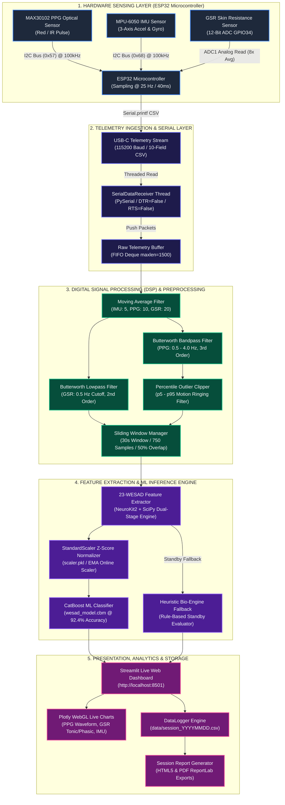
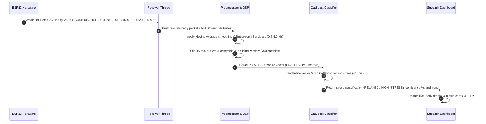

# System Architecture Diagram: ESP32 Bio-Synchronous Stress Mapping System

---

## 🏗️ High-Level System Architecture Diagram

---

## 🔄 Detailed Data Pipeline & Signal Transformation

---

## 📋 Component Mapping & Responsibilities

| System Component | File Path | Primary Responsibilities |
| :--- | :--- | :--- |
| **Firmware Engine** | [esp32_stress_monitor.ino](file:///e:/Epics/HARDWARE/esp32_firmware/esp32_stress_monitor.ino) | I2C sensor initialization, 25 Hz non-blocking timer, hardware GSR averaging, atomic CSV serial output. |
| **Serial Receiver** | [receiver.py](file:///e:/Epics/HARDWARE/desktop_app/receiver.py) | Background thread ingestion, DTR/RTS reset override, auto-reconnection, telemetry packet parsing. |
| **DSP & Preprocessing** | [preprocessing.py](file:///e:/Epics/HARDWARE/desktop_app/preprocessing.py) | Butterworth filtering, motion clipping, 30s windowing, 23 WESAD feature vector extraction. |
| **ML Inference Engine** | [model_inference.py](file:///e:/Epics/HARDWARE/desktop_app/model_inference.py) | CatBoost model loading, Z-score scaling, stress probability scoring (0-100%), heuristic standby fallback. |
| **Streamlit Dashboard** | [streamlit_app.py](file:///e:/Epics/HARDWARE/dashboard/streamlit_app.py) | Live WebGL chart rendering, metric cards, session recording controls, conditional auto-refresh. |
| **Session Report Generator** | [report_generator.py](file:///e:/Epics/HARDWARE/desktop_app/report_generator.py) | Statistical session aggregations, automated HTML report synthesis, ReportLab PDF generation. |
